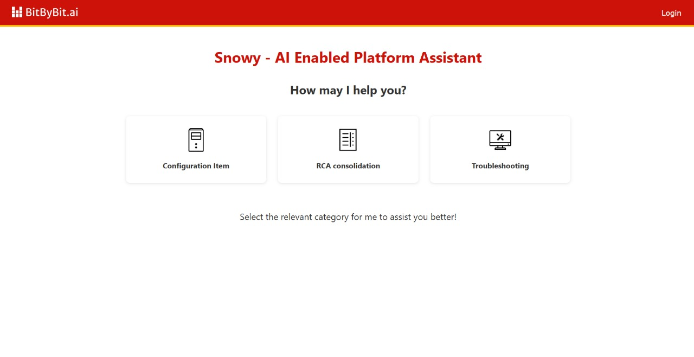
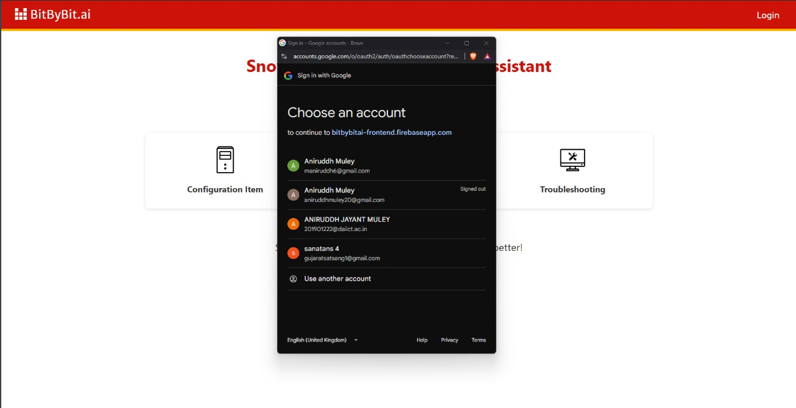
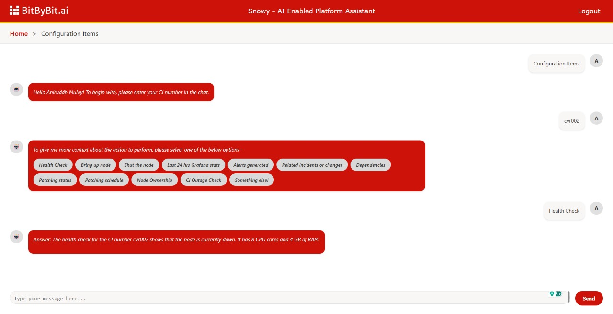
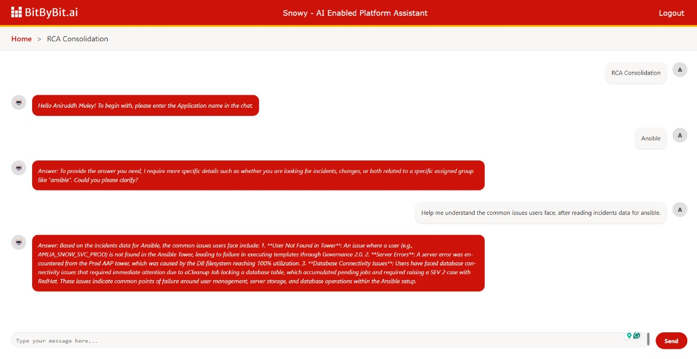
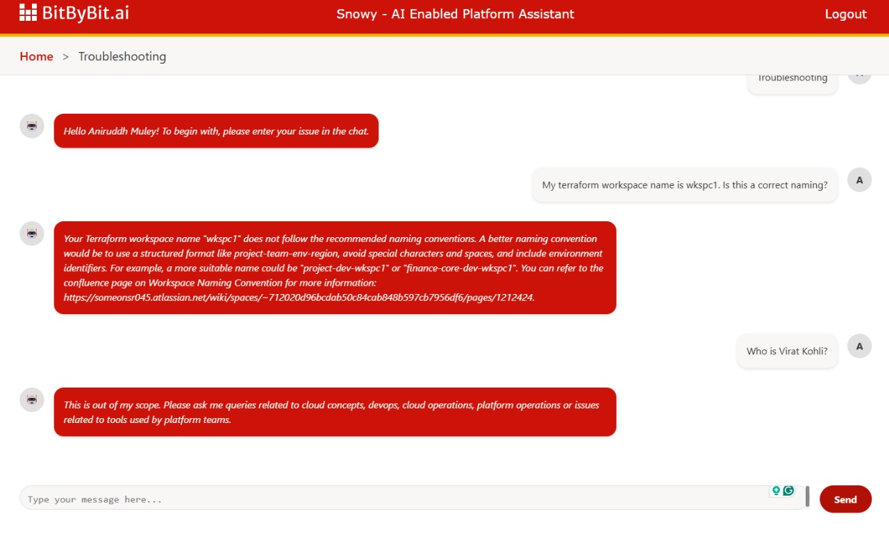
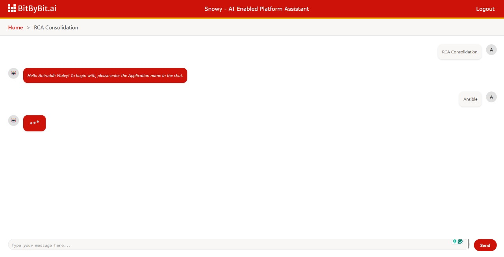

# 🚀 Snowy by BitByBit.ai


## 📌 Table of Contents
- [Introduction](#-introduction)
- [Demo](#-demo)
- [Inspiration](#-inspiration)
- [What It Does](#-what-it-does)
- [How We Built It](#-how-we-built-it)
- [Challenges We Faced](#-challenges-we-faced)
- [How to Run](#-how-to-run)
- [Tech Stack](#-tech-stack)
- [Team](#-team)

---

## 🎯 Introduction
Snowy, by BitByBit.ai, is a work-buddy that every platform support/operation engineer would love to have. This AI Enabled Platform Assistant chatbot serves as a one-stop solution for the platform engineers, where they will be able to perform operations and trigger automations, helping the engineers save the time/effort overhead. 

## 🎥 Demo
📹 [Video Demo](https://youtu.be/gH6GXmbNFlI)
🖼️ Screenshots:








## 💡 Inspiration
While solving a user ticket, the platform support requires troubleshooting, accessing a variety of Knowledge Base articles, running automation scripts, reviewing telemetry / observability metrics and leveraging foundational information about Configuration Items. This involves frequent context switching, leading to a significant time/effort overhead. Being a part of platform team, we have witnessed our platform support teams struggling with this and we realized that if this problem is solved, it can help the platform support teams to support our customers better, with a faster resolution time. 


## ⚙️ What It Does
The chatbot has a user-centric, intuitive and interactive interface, with the agentic capabilities and contextual reccomendations and data extraction. The chatbot provides these features in 3 major classifications:

### Configuration Items 
To enquire and troubleshoot issues in the context of the configuration items. The present functionalities include: 
- Health Check
- Bring up the Node
- Last 24 hours stats
- Alerts triggered
- Related Incidents/Changes

Some others which will be implemented in future are:
- Dependencies
- Patching Status
- Patching Schedule
- Node Ownership
- CI Outage Check


### RCA Consolidation 
To summarize the root cause for an application based on the incidents or changes of an assignment group, i.e. application. It will pull in all the incidents/changes for the application, read through the resolution notes and description, summarize the data collected and provide it to the user.  


### Troubleshooting 
To self troubleshoot issues with knowledge base articles and implement solutions through continuous learning. This capability will help the platform support teams to debug issues related to tools like Terraform, Ansible, GitHub, Servicenow and other cloud operations and platform support tools. As a part of future implementation, it will also be able to implement the solutions, only after the user provides the required permissions. 


## 🛠️ How We Built It
We developed Snowy using a modern tech stack with a clear separation between frontend and backend:

### Frontend
- Built with React and Vite for a fast, modern development experience
- Utilized modern UI components for an intuitive chat interface
- Implemented real-time updates and responsive design

### Backend
- Developed using Flask, a lightweight Python web framework
- Integrated with Groq LLM Client for advanced AI capabilities
- Used Firebase Admin SDK for data storage and management
- Implemented web scraping capabilities using BeautifulSoup (bs4) for knowledge base article processing
- Built modular architecture with separate components for:
  - Configuration Items (CI) management
  - Root Cause Analysis (RCA)
  - Troubleshooting assistance

### Integration & Deployment
- Used Flask-CORS for secure cross-origin communication
- Implemented environment management using python-dotenv
- Deployed using Gunicorn for production-grade serving
- Utilized LLMs (llama-3.3-70b-versatile and qwen-2.5-32b) for advanced natural language processing

The architecture is designed to be modular and scalable, allowing for easy addition of new features and capabilities as the platform grows.

## 🚧 Challenges We Faced
Describe the major technical or non-technical challenges your team encountered.
- Agentic AI was a completely new concept for the team to understand and implement, so we had to start from scratch. 
- Systems breaking unexpectadely due to credits getting over from free tools. 
- Structuring enterprise level data, without having API access and mocking them using free cloud data storage products.
- A fun challenge of collating different ideas from stakeholders, and productizing the solution for creating an amazing user experience. 


## 🏃 How to Run
1. Clone the repository  
   ```sh
   git clone https://github.com/ewfx/gaipl-bit-by-bit-ai.git
   ```

### Frontend 
1. Go to folder
   ```sh
   cd code/src/frontend
   ```
2. Install dependencies  
   ```sh
   npm install  # or pip install -r requirements.txt (for Python)
   ```
3. Run the project  
   ```sh
   npm run dev  # or python app.py
   ```

### Backend 
1. Go to folder
   ```sh
   cd code/src/backend
   ```
2. Setup venv and install dependencies (Windows)
   ```sh
   python -m venv venv
   Set-ExecutionPolicy -Scope Process -ExecutionPolicy Bypass
   .\venv\Scripts\activate
   pip install -r requirements.txt # (for Python)
   ```
3. Run the project  
   ```sh
   python app.py
   ```

## 🏗️ Tech Stack
- 🔹 Frontend: React
- 🔹 Backend: Flask
- 🔹 Database: Firebase
- 🔹 Other: Groq LLM Client
- 🔹 LLM: llama-3.3-70b-versatile, qwen-2.5-32b

## 👥 Team
- **Biswajeet Raut** - [GitHub](https://github.com/BiswajeetRaut/) | [LinkedIn](https://www.linkedin.com/in/biswajeet-raut-9b14b0267/)
- **Aniruddh Muley** - [GitHub](http://github.com/Aniruddhmuley2001/) | [LinkedIn](https://www.linkedin.com/in/aniruddh-muley-647884193/)
- **Atharva Nanotkar** - [GitHub](https://github.com/atharva168) | [LinkedIn](https://www.linkedin.com/in/atharva-nanotkar-828979204/)
- **Dileep Bhatala**
- **Ramachandra Boyapati** - [LinkedIn](https://www.linkedin.com/in/ramachandra-boyapati-3197141a1/)
